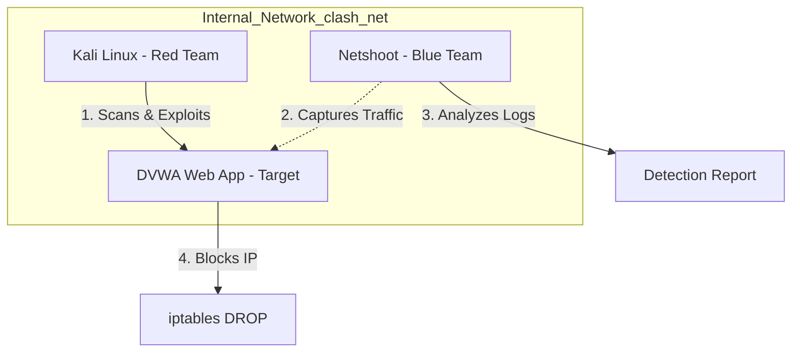

# Clash of Teams 101 – Breach & Defend


A fully automated cybersecurity lab demonstrating the complete attack lifecycle:
Reconnaissance → Detection → Remediation.

This project simulates a real-world SOC workflow using containerized environments and automated scripts.

## Key Highlights
- Automated Red Team attack using Nmap and Metasploit
- Network traffic capture and analysis
- Automated incident response with firewall blocking
- One-command full attack–defense pipeline
- Fully containerized using Docker

## Skills Demonstrated
- Penetration testing basics
- Network traffic analysis
- Bash automation
- Docker-based lab environments
- Incident response workflows

## Quick Demo (One Command)

Run the entire attack–detect–defend pipeline:

```bash
bash automation/run_full_pipeline.sh
```

This will:
1. Start the lab environment
2. Launch automated attacks
3. Capture network traffic
4. Analyze suspicious activity
5. Block the attacker automatically

## Why This Project Matters
This project demonstrates the full cybersecurity incident lifecycle, similar to real SOC operations. It shows how automated detection and response can stop an attacker in real time.

---

## 🏗️ Architecture

The lab consists of three isolated containers running on an internal bridge network (`clash_net`).




---

## 🚀 Getting Started

### Prerequisites
-   **Docker** and **Docker Compose** installed.
-   4GB+ RAM recommended.
-   Linux/Mac/WSL2 environment (for running bash scripts).

### 1. Setup
Clone the repository and start the environment (if not running via the quick demo script):

```bash
cd infrastructure
docker compose up -d
```

---

## 📂 Project Structure

```
clash-of-teams-101/
├── README.md              # Project Documentation
├── LICENSE                # MIT License
├── .gitignore             # Git Configuration
├── automation/
│   ├── attack_pipeline/   # Red Team Scripts (Nmap, Metasploit)
│   ├── remediation/       # Blue Team Response (iptables blocking)
│   └── run_full_pipeline.sh # Master Automation Script
├── defender/
│   └── log_analysis/      # Blue Team Detection (tcpdump, tshark)
├── docs/
│   ├── final_report.md    # Comprehensive Academic Report
│   └── setup.md           # Detailed setup guide
├── infrastructure/
│   └── docker-compose.yml # Lab Environment Definition
└── reports/               # Generated Artifacts (Logs, PCAPs)
```

---

## 📊 Sample Output

### Detection Report (`reports/defense_logs/traffic_summary.txt`)
```text
=== Top Talkers ===
1000 packets: 172.18.0.3 -> 172.18.0.2 (Port Scanning)
...
```

### Blocking Log (`reports/remediation_logs/block_log.txt`)
```text
Mon Feb 16 19:40:00 UTC 2026 | ACTION: Blocked IP 172.18.0.3 | CONTAINER: victim-dvwa
```


## 👤 Author
Yash Mahale  
Cybersecurity Student
